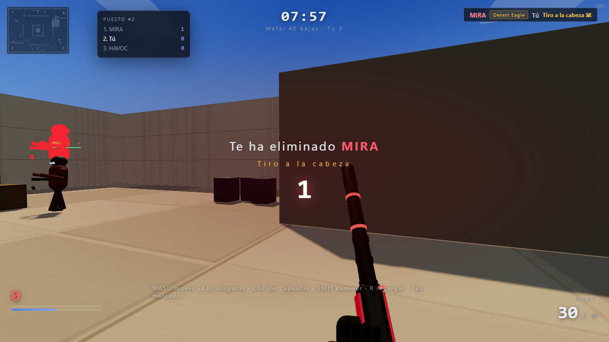

# NEXUS · Campo de tiro

Un shooter táctico 3D para navegador, inspirado en la estética de los FPS tácticos modernos. Es un **deathmatch** local contra bots: gana el primero que llega a 40 bajas, o quien vaya primero cuando se acaben los 8 minutos.



## Qué incluye

- **Modo deathmatch** contra 3–7 bots (configurable), con marcador, racha y MVP.
- **Campo de tiro** para practicar puntería: blancos cercanos, lejanos y de cabeza, munición infinita.
- **4 armas**: M4A1, Desert Eagle, cuchillo táctico y rifle de francotirador con mira 2,5x.
- **Movimiento táctico**: parada en seco, agacharse, caminar, saltar y puntería con clic derecho.
- **Bots con IA**: patrullan, buscan cobertura, flanquean y tienen tres niveles de dificultad.
- **Audio generado por código** con WebAudio: no hay archivos de sonido externos.
- **Idiomas**: español (por defecto), chino e inglés.

## Requisitos

- [Node.js](https://nodejs.org/) 18 o superior.
- Un navegador moderno (Chrome, Edge o Firefox).

## Cómo ejecutarlo

```bash
npm install
npm run dev
```

Abre `http://localhost:5173/` en el navegador.

Para crear una versión de producción:

```bash
npm run build
npm run preview
```

## Controles

| Tecla | Acción |
| --- | --- |
| `W` `A` `S` `D` | Moverse |
| `Ratón` | Mirar · clic izquierdo disparar · clic derecho apuntar / golpe fuerte |
| `Shift` / `Ctrl` / `Espacio` | Caminar / agacharse / saltar |
| `1` `2` `3` `4` | M4 / Desert Eagle / cuchillo / francotirador |
| `Q` / rueda | Cambiar de arma |
| `R` | Recargar |
| `Tab` | Marcador |
| `M` | Minimapa |
| `Esc` | Pausa |

## Tests

```bash
npm test
```

Los tests usan un navegador Edge sin interfaz para verificar el juego, la puntería, los bots, el campo de tiro y la interfaz.

## Estructura

```
src/
├── main.js        # entrada y bucle principal
├── config.js      # configuración
├── i18n.js        # español / inglés / chino
├── player.js      # movimiento y disparo
├── bots.js        # IA de los bots
├── weapons.js     # modelos de las armas
├── ui.js          # HUD, menú y ajustes
└── world/         # mapa, colisiones y navegación
```

---

## English

**NEXUS** is a browser-based 3D tactical shooter inspired by modern tactical FPS games. It's a local deathmatch against bots: first to 40 kills, or whoever is leading after 8 minutes.

Features include a 3–7 bot deathmatch, a training range, four weapons (M4A1, Desert Eagle, knife, sniper), tactical movement, AI bots with pathfinding, procedural WebAudio sound, and three languages (Spanish by default, Chinese, and English).

Run it with `npm install` and `npm run dev`, then open `http://localhost:5173/`.
